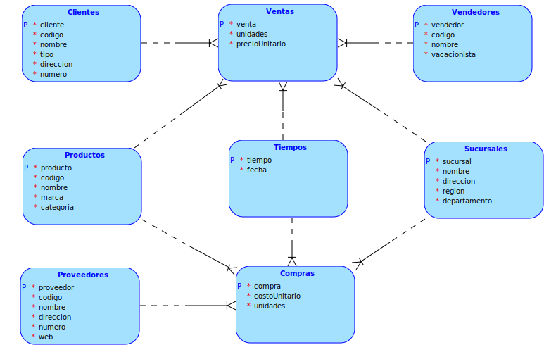

<p style="font-size: 18px">
Universidad de San Carlos de Guatemala
<br>
Facultad de Ingeniería
<br>
Escuela de Ciencias y Sistemas
<br>
Seminario de Sistemas 2
<br>
Ing. Luis Alberto Vettorazzi Espana
<br>
Aux. Gabriela Marilyn Orellana Solorzano
</p>

<br><br><br><br>


<h1 align="center" style="font-size: 40px; font-weight: bold;">OneSolution - BI | Fase 1</h1>

<br><br><br>


<div align="center">

| Carnet | Nombre |
| :-: | :-:| 
| 201700965 | José Carlos I Alonzo Colocho |

</div>

<br><br>

<h4 align="center" style="font-size: 18px; font-weight: bold;">Guatemala 09 de Marzo 2022</h4>


*** 


<br><br><br><br>

*** 

<h1>Tabla de Contenido</h1>

- [**1. Creacion de ETL**](#1-creacion-de-etl)
- [**2. Justificacion del modelo**](#2-justificacion-del-modelo)


<br><br>

***
# **1. Creacion de ETL**


Primeramente se utilizo un componente **Tarea Ejecutar SQL** para poder ejecutar sentencias SQL, utilizadas en la limpieza de registros en las tablas del modelo.

Seguido de ello se utilizo un **Tarea Script** para poder ejecutar codigo nativo de Visual Studio, con el cual se lleva a cabo la lectura de los **N** archivos de entrada tanto de compras como de ventas, para el llenado de las tablas temporales. 

Ya teniendo cargadas las tablas temporales, se realiza la carga primeramente hacia las tablas de dimensiones y luego a las tablas de hechos.

<br>

Mediante el componente **Data Flow Task**, para la imagen adjunta, se presenta el caso del flujo interno utilizado en la carga de la dimension de clientes; en dicho flujo se utilizan los componentes **OLE DB Source** para la obtencion de datos desde la base de datos, **Conditional Split** para la validacion y filtrado de datos erroneos, **Derived column** para el casteo de valores necesarios para la insercion en el modelo, **Sort** para retirar los datos repetidos, **OLE DB Destination** para la insercion de los datos filtrados en la base de datos y el componente **Union All** no utilizado en dicha imagen pero necesario para aquellas dimensiones que son compartidas en los distintos tipos de archivos de entrada.
 


La carga del resto de dimensiones es exactamente la misma variando unicamente en validaciones y conversiones de tipo utilizadas en el modelo.


<br>


Ahora si nos dirigimos al llenado de las tablas de hechos tambien fueron realizados mediante el componente **Data Flow Task**, sin embargo su flujo es un poco mas amplio debido a la relacion que existe entre este tipo de tablas y sus dimensiones; en dicho llenado de tablas se hace uso de dos componentes nuevos a comparacion de los utilizados en el llenado de las tablas de dimensiones, estos son, **Lookup** el cual es utilizado para comparar valores y devolver otros campos de la tabla similar a lo que se haria con una consulta del tipo 

```SQL
SELECT <valor> FROM <tabla> WHERE <valorAComparar> = <Parametro>;
```

y el componente **Data Conversion** utilizado para castear los algunos para su insercion y comparacion en la base de datos.


La carga del resto de hechos es exactamente la misma variando unicamente en validaciones y conversiones de tipo utilizadas en el modelo.

<br><br>

***
# **2. Justificacion del modelo**



El modelo utilizado como base para el desarrollo de la solución fue el **modelo estrella**, esto con el fin de reducir la normalizacion para tener un mayor tiempo de respuesta al momento de realizar consultas evitando **joins** de cualquier tipo innecesarios para el echo de una base de datos que sera dedicada unicamente al analisis de datos, razon por la cual no buscamos el mejor tiempo medio de respuesta al normalizar una base de datos si no que unicamente el menor tiempo posible al momento de consultar la misma.