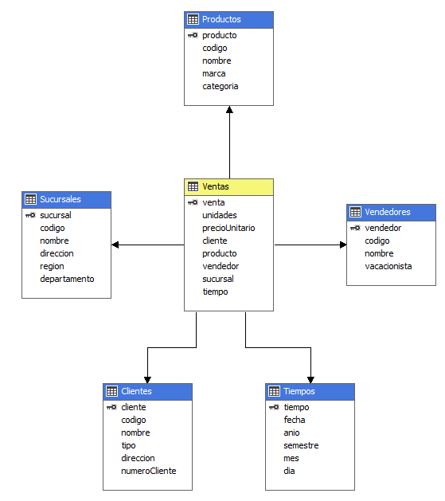

Universidad de San Carlos de Guatemala
 
Facultad de Ingeniería
 
Escuela de Ciencias y Sistemas
 
Seminario de Sistemas 2
 
Ing. Luis Alberto Vettorazzi Espana
 
Aux. Gabriela Marilyn Orellana Solorzano

    

<h1 align="center" style="font-size: 40px; font-weight: bold;">OneSolution - BI | Fase 2</h1>

   

| Carnet | Nombre |
| :-: | :-:| 
| 201700965 | José Carlos I Alonzo Colocho |

  

<h4 align="center" style="font-size: 18px; font-weight: bold;">Guatemala 04 de Abril 2022</h4>

*** 

    

*** 

<h1>Tabla de Contenido</h1>

- [**1. Datamarts**](#1-datamarts)
- [**2. Tableros de Power BI**](#2-tableros-de-power-bi)
- [**3. Comparacion de almacenamiento**](#3-comparacion-de-almacenamiento)

  

***
# **1. Datamarts**

1.1. Cubo de compras por filas

 

1.2. Cubo de ventas por filas

 

1.3. Cubo de compras columnar

 

1.4. Cubo de ventas columnar

  

***
# **2. Tableros de Power BI**

2.1. Tablero almacenamiento por filas

 

2.2. Tablero almacenamiento columnar

  

***
# **3. Comparacion de almacenamiento**

3.1. Reportes de compras

| Reporte No. | Filas | Columnar |
| :-: | :-: | :-: | 
| 1 | 00:01.29 s | 00:01.20 s |
| 2 | 00:01.47 s | 00:01.13 s |
| 3 | 00:00.97 s | 00:00.95 s |

3.2. Reportes de ventas

| Reporte No. |Filas | Columnar |
| :-: | :-: | :-: | 
| 1 | 00:01.38 s | 00:00.83 s |
| 2 | 00:01.50 s | 00:01.46 s |
| 3 | 00:01.19 s | 00:01.05 s |

Como se puede denotar el almacenamiento columnar es por unas cuantas centecimas en la mayoria de los casos mas rapida que el almacenamiento tradicional por filas, con lo cual al tener un volumen de datos mucho mayor o consultas mas complicadas esta ventaja de tiempo puede verse incrementada en mayor medida.